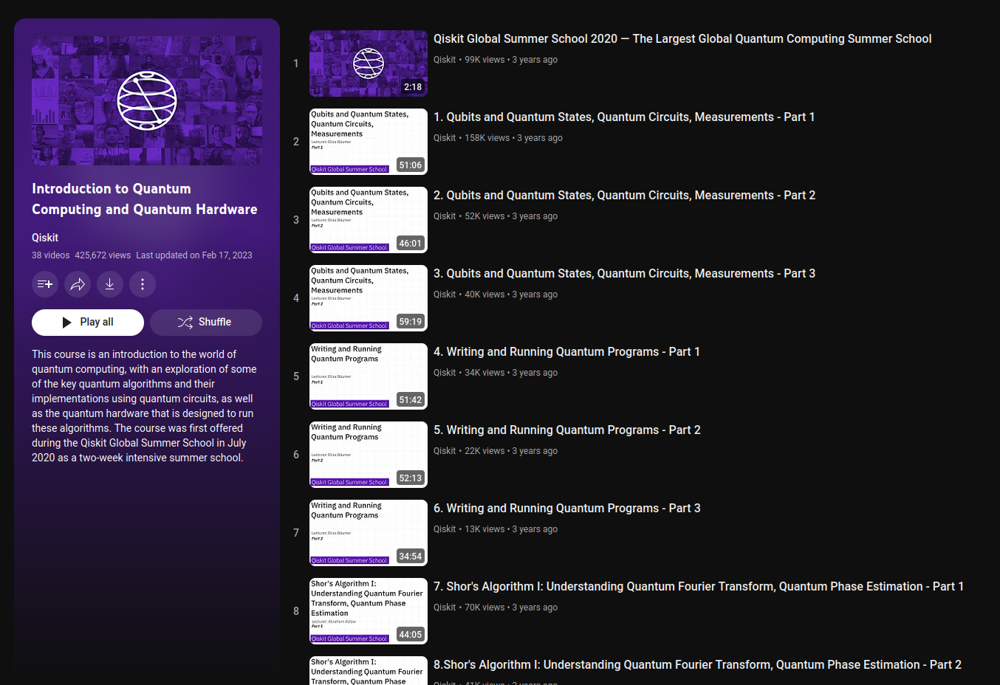

# Roadmap to Learn Quantum Computing

## 1. **Foundations of Quantum Computing**

### **Videos:**
- **[The Map of Quantum Computing](https://youtu.be/-UlxHPIEVqA?si=Bp3XJor4jQwGVdeF)**
  - Overview of the quantum computing landscape.
  

- **[A Beginner's Guide to Quantum Computing](https://youtu.be/QuR969uMICM?si=QKiPiim7yOxJzO6V)**
  - Introduction to basic quantum computing concepts.
  
- **[Quantum Computers: Limits of Human Technology](https://youtu.be/JhHMJCUmq28?si=C7epSsq4juniy1Ck)**
  - Discussion on the current limits and potentials of quantum technology.
  

### **Books:**
- **[Introduction to Classical and Quantum Computing](Docs/1.pdf)** 
  - Comprehensive foundation in both classical and quantum computing.
  

## 2. **Mathematical Foundations**

### **Videos:**
- **[Quantum Computing Course – Math and Theory for Beginners](https://youtu.be/tsbCSkvHhMo?si=s9ULPRci17mJeLnk)**
  - Mathematical concepts essential for understanding quantum computing.
  

## 3. **Quantum Machine Learning**

### **Research Papers:**
- **[An Introduction to Quantum Machine Learning](Docs/2a.pdf)**
  - Overview of quantum machine learning concepts.
  
- **[Machine Learning for Quantum Computing Specialists](Docs/2b.pdf)**
  - In-depth analysis of machine learning techniques in quantum computing.
  

### **Books:**
- **[An Introduction to Quantum Machine Learning for Engineers](Docs/3.pdf)**
  - Guide for engineers on quantum machine learning applications.
  
- **[Supervised Learning with Quantum Computers](Docs/4.pdf)**
  - Detailed exploration of supervised learning techniques in quantum computing.
  

## 4. **Quantum Computing in Practice**

### **Videos:**
- **[Introduction to Quantum Computing NPTEL IITM-IBM](https://youtube.com/playlist?list=PLuBwWyD3M82x9PfxeF7oxb0E122mQAWh6&si=njX1y-CX2xJ_VhE4)**
  - Comprehensive course on quantum computing fundamentals.
  
- **[Introduction to Quantum Computing and Quantum Hardware Qiskit](https://youtube.com/playlist?list=PLOFEBzvs-VvrXTMy5Y2IqmSaUjfnhvBHR&si=EC5HLpQhB47H4bhz)**
  - Practical tutorials on using Qiskit for quantum computing.
  

